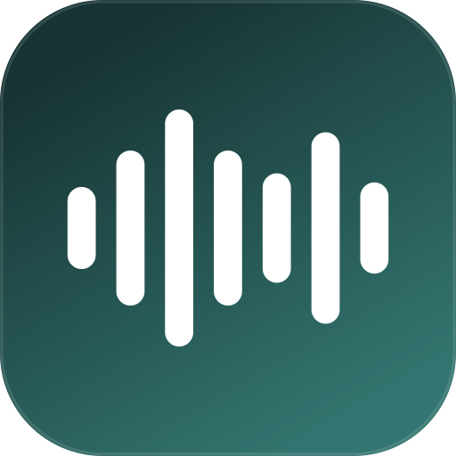
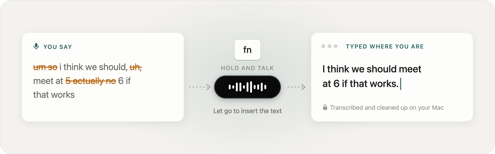
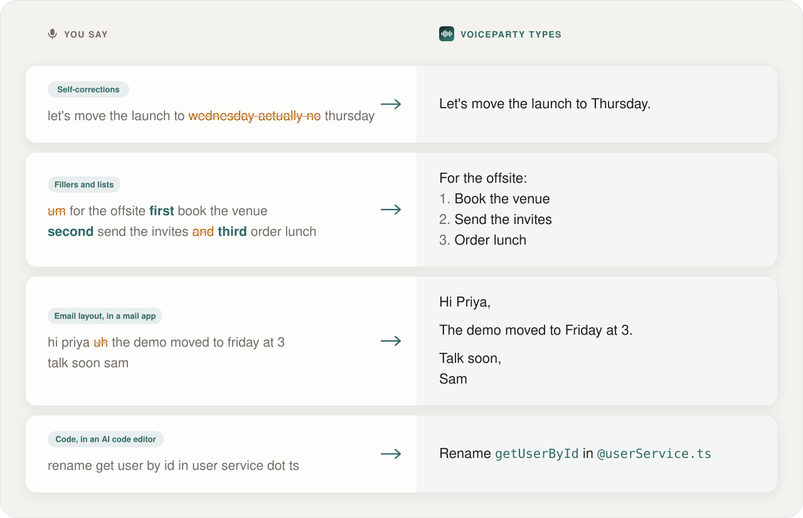
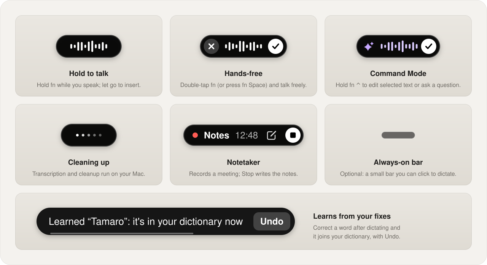
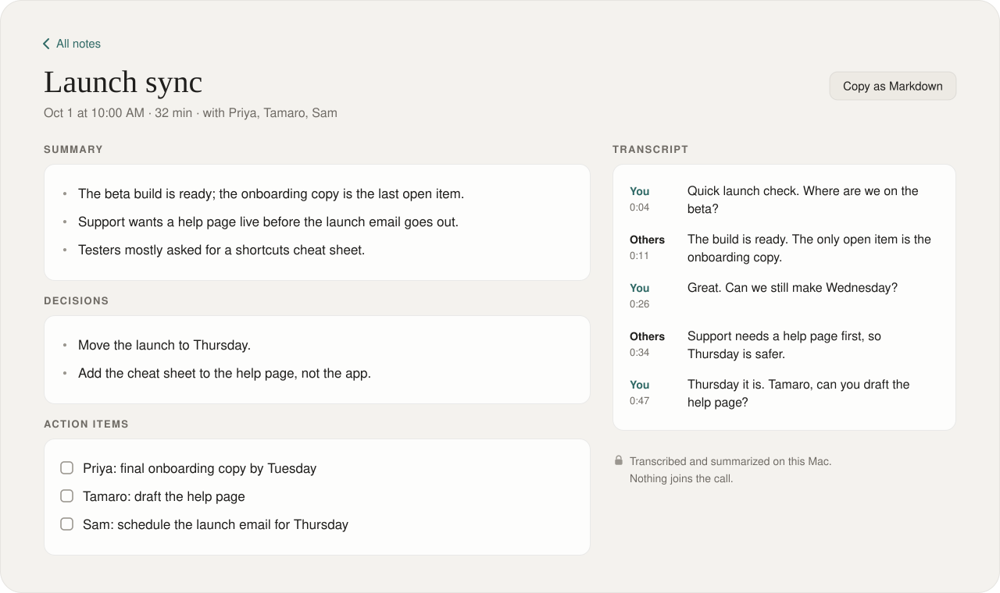

<div align="center">



<h1>VoiceParty</h1>

<p><b>Hold a key, talk, and clean text appears wherever your cursor is.</b><br>
Private dictation for macOS. Speech recognition and cleanup run on your Mac, in any app.</p>

<p>
<a href="LICENSE"></a>

<a href="#privacy"></a>
</p>

<p>
<a href="#install"><b>Install</b></a> ·
<a href="#features">Features</a> ·
<a href="#shortcuts">Shortcuts</a> ·
<a href="#privacy">Privacy</a> ·
<a href="#notetaker">Notetaker</a> ·
<a href="#faq">FAQ</a>
</p>

</div>

<p align="center">
  <a href="docs/media/voiceparty-demo.mp4">
    
  </a>
</p>

## How it works

1. **Hold** <kbd>fn</kbd> in any app with a text field: email, chat, notes, your code editor, a browser.
2. **Talk** the way you normally do. The "um"s, false starts and "actually, make that six" are fine.
3. **Let go.** VoiceParty transcribes and tidies what you said on your Mac and pastes it where your cursor is.

Prefer not to hold a key? Double-tap <kbd>fn</kbd> for hands-free mode and press it again when you're done.

<p align="center">
  <picture>
    <source media="(prefers-color-scheme: dark)" srcset="docs/images/hero-dark.svg">
    <source media="(prefers-color-scheme: light)" srcset="docs/images/hero-light.svg">
    
  </picture>
</p>

## Why VoiceParty

- **Private by design.** Speech recognition and AI cleanup run on your Mac. VoiceParty has no servers and no
  account, and doesn't send what you say anywhere.
- **Keeps your words.** Cleanup is a light copy edit, not a rewrite: fillers and false starts go, self-corrections
  are applied, and numbers, lists and email layout come out right. Your original words stay in history.
- **Learns your vocabulary.** Names and jargon go in a dictionary that also learns from the words you correct.
- **Free and open source.** Apache-2.0-licensed Swift. Your data lives in one folder on your Mac and moves to another Mac
  as a single file.

## Features

<p align="center">
  <picture>
    <source media="(prefers-color-scheme: dark)" srcset="docs/images/cleanup-dark.svg">
    
  </picture>
</p>

### Dictation

- **Works in any app.** Text is pasted with the clipboard and ⌘V (native, Electron and web apps alike), then your
  clipboard is put back. With no text field focused, the text stays on the clipboard instead.
- **Speech to text** with Apple's on-device speech recognition, or NVIDIA's Parakeet model as an optional download.
- **Cleanup** with Apple Intelligence when it's on, or small open models you can download
  ([Enhancements](#enhancements)). Built-in rules take over when neither is available.
- **Cleanup level and per-app styles.** Choose None, Light or Medium editing, and a style (Formal, Casual, Very
  casual, Excited!) for each kind of app: personal messages, work chat, email and everything else.
- **Context aware.** Reads a little text around your cursor, locally, to spell names right. Reading the screen
  for names is optional and off by default.
- **Code aware.** Say a file name in Cursor or Windsurf and it's written as `@file.tsx`; optionally spells
  identifiers from your editor (`getUserById`) in VS Code, Cursor, Windsurf and Xcode.

### Make it yours

- **Dictionary.** Add names, product words and jargon (`Tamaro`, `Kubernetes`). Correct a word right after dictating and
  VoiceParty learns it (with Undo). Replacements like `btw → by the way` apply to every dictation.
- **Snippets.** Say "my calendar link" or "intro email" and the full text is typed for you.
- **Transforms.** Select text in any app and press <kbd>⌥</kbd> <kbd>1</kbd> to Polish it or <kbd>⌥</kbd>
  <kbd>2</kbd> to turn rough thoughts into a clear AI prompt. Write your own on <kbd>⌥</kbd> <kbd>3</kbd>–<kbd>9</kbd>,
  or run one after every dictation.
- **Command Mode.** Select text, hold <kbd>fn</kbd> <kbd>⌃</kbd> and say how to change it ("make this friendlier").
  With nothing selected, ask a question and copy or insert the answer.
- **Bring your setup.** Import a dictionary from CSV, snippets from JSON, or your dictionary, replacements and
  snippets from Wispr Flow if you used it.

### Everything else

- **The dictation bar** at the bottom of the screen shows what's happening, and can stay visible as a small bar you
  click to dictate.
- **History** you can search, replay and retry, with "Restore what you said" to undo any AI edit. Choose how long
  history and recordings are kept, or never store them.
- **Insights** (words per minute, words dictated, streaks), computed from your local history.
- **Notetaker** for meetings, [described below](#notetaker).
- **Profile export** moves your dictionary, snippets, transforms and preferences to another Mac in one file.

<p align="center">
  <picture>
    <source media="(prefers-color-scheme: dark)" srcset="docs/images/dictation-bar-dark.svg">
    
  </picture>
</p>

## Install

**Needs:** a Mac with Apple silicon (M1 or later) and macOS 26 or later. Apple Intelligence is optional.

Open Terminal (⌘Space, type `Terminal`), paste this line and press Return:

```bash
curl -fsSL https://raw.githubusercontent.com/voiceparty-app/VoiceParty/main/install.sh | bash
```

VoiceParty opens when it's done. Allow **Microphone** and **Accessibility** when it asks (it shows you where), pick
your dictation key, then click into any text box, hold the key and talk. The first time, macOS downloads Apple's
speech model once.

**What the installer does.** VoiceParty isn't notarized by Apple (that needs a paid developer account), so the
installer does the checking instead: the download must match its published SHA-256 checksum and be signed with
VoiceParty's own certificate, or nothing is installed. It then removes macOS's download flag (the "quarantine"
attribute) so the app opens without Gatekeeper's warning. Read [install.sh](install.sh) before you run it if you
like; [docs/INSTALL.md](docs/INSTALL.md) has the details.

- **Updates:** VoiceParty checks GitHub for a newer version once a day (only the version number is fetched; turn it
  off in Settings) and installs an update only if it's signed with the same certificate. Running the install line
  again also updates, and keeps your settings, history and dictionary.
- **Uninstall:** `curl -fsSL https://raw.githubusercontent.com/voiceparty-app/VoiceParty/main/install.sh | bash -s -- --uninstall`
  (add `--delete-data` to also remove history, dictionary and downloaded models).

> [!NOTE]
> VoiceParty is at version 0.1. Dictation is English (United States) only for now.

## Shortcuts

| Action | Default |
|---|---|
| Push to talk | Hold <kbd>fn</kbd> |
| Hands-free | Double-tap <kbd>fn</kbd>, or <kbd>fn</kbd> <kbd>Space</kbd> |
| Command Mode | Hold <kbd>fn</kbd> <kbd>⌃</kbd> |
| Cancel | <kbd>Esc</kbd> |
| Paste last transcript | <kbd>⌃</kbd> <kbd>⌘</kbd> <kbd>V</kbd> |
| Copy last transcript | <kbd>⌃</kbd> <kbd>⌘</kbd> <kbd>C</kbd> |
| Transforms | <kbd>⌥</kbd> <kbd>1</kbd> Polish, <kbd>⌥</kbd> <kbd>2</kbd> AI Prompt, your own on <kbd>⌥</kbd> <kbd>3</kbd>–<kbd>9</kbd> |
| Show the last transform's changes | <kbd>⌥</kbd> <kbd>O</kbd> |
| Press Return (e.g. from a mouse button) | Not set |

Your dictation key can be <kbd>fn</kbd>, <kbd>Right ⌥</kbd> or <kbd>Right ⌃</kbd>; the other defaults follow it.
Every action takes up to four shortcuts, mouse buttons included (Settings → Shortcuts).

## Enhancements

VoiceParty works without any downloads. These optional ones make it faster and more accurate. Each is fetched only
when you choose it, pinned to an exact version on GitHub or Hugging Face, checked against its SHA-256 fingerprint
when installed and again before each use, and run only on your Mac.

| Enhancement | What it adds | Download | License |
|---|---|---|---|
| **More accurate speech recognition**<br><sub>NVIDIA Parakeet Unified EN 0.6B, Core ML conversion by FluidInference</sub> | Runs on the Neural Engine and transcribes a typical dictation in about 0.1 s. In the project's tests on real dictation it misheard fewer words than Apple's engines (9.0% vs 11.4% word error rate). English only. Licensed by NVIDIA Corporation under the NVIDIA Open Model License. | ~614 MB | [NVIDIA Open Model License](https://www.nvidia.com/en-us/agreements/enterprise-software/nvidia-open-model-license/) |
| **Fast cleanup**<br><sub>S1-mini by Superwhisper</sub> | A small model made for tidying dictation: cleaner text in about a tenth of a second. Recommended for 8 GB of memory or more. | 484 MB | [Apache-2.0 + naming terms](https://huggingface.co/superwhisper/s1-mini-GGUF/blob/main/LICENSE) |
| **Smart cleanup for your words & code**<br><sub>Qwen3 4B Instruct 2507 by Alibaba Cloud, GGUF by Unsloth</sub> | Handles "actually, make that six", dictionary names, email layout and code, and writes meeting notes. Uses about 3 GB of memory while loaded; recommended for 16 GB or more. | 2.5 GB | [Apache-2.0](https://huggingface.co/Qwen/Qwen3-4B-Instruct-2507/blob/main/LICENSE) |
| **Local AI engine**<br><sub>llama.cpp b11146, installed with either cleanup model</sub> | Runs the cleanup models on your Mac's GPU. It listens only on 127.0.0.1, with a random key per launch. | 11 MB | [MIT](https://github.com/ggml-org/llama.cpp/blob/master/LICENSE) |

With the local models, cleanup typically takes 0.1–0.2 s. To free memory, the default "Load when I dictate" setting
unloads them after 5 idle minutes; they reload in about a second.

## Privacy

Speech recognition and cleanup run on your Mac. Your history, recordings, notes and dictionary stay in
`~/Library/Application Support/VoiceParty`, and you choose how long history and recordings are kept.

- **Password fields** leave no trace: no history, no recording, no learning, no AI model, and the pasted text is
  marked so clipboard managers skip it.
- **Context** (a little text around your cursor) is read on your Mac and skipped in password fields. Screen reading
  is off unless you turn it on, never looks at password managers, and saves nothing.
- **Local models** listen only on this Mac (127.0.0.1) and need a key that changes every launch.

### What goes over the network

- The optional downloads you choose under Enhancements, from pinned versions on GitHub and Hugging Face,
  verified before they're installed and again before each use.
- The daily update check, if it's on.

Apple's speech model is downloaded once by macOS itself; recognition then runs offline. Your speech, transcripts,
notes and dictionary aren't uploaded by VoiceParty. Text you paste into other apps is then up to those apps.

## Notetaker

<p align="center">
  <picture>
    <source media="(prefers-color-scheme: dark)" srcset="docs/images/notetaker-dark.svg">
    
  </picture>
</p>

Start the Notetaker from the menu bar or the Notes page, or let VoiceParty offer it when a call starts (Zoom,
Teams, FaceTime, Webex, Slack or a browser call using your mic). It transcribes you (your microphone) and everyone
else (your Mac's audio) as the meeting goes, and when you stop (or the call ends) it writes a **summary, decisions
and action items**, all on your Mac. Nothing joins the call.

- A small notepad takes your own notes during the meeting; what you write leads the summary.
- With Calendar access, notes are named after the event and attendees' names are spelled right. Your calendar is
  read on your Mac only.
- Copy any note as Markdown. Written notes need Smart cleanup or Apple Intelligence; the transcript is always there.

### Recording other people

Laws on recording conversations differ by place, and many require everyone's consent. The Notetaker
explains this the first time you use it and offers a message you can paste into the call's chat. You're
responsible for telling the people you record and for following the law where you and they are.

## FAQ

### Why only macOS 26 and Apple silicon?

VoiceParty is built on Apple's on-device speech recognition and language model frameworks, which arrived in
macOS 26, and the optional models run on Apple silicon's GPU and Neural Engine.

### Do I need Apple Intelligence?

No. Without it (and without Enhancements), cleanup uses built-in rules. Command Mode and Transforms need an AI model:
Apple Intelligence or a cleanup Enhancement. Meeting summaries need Smart cleanup or Apple Intelligence.

### Does it work offline?

Yes. After the one-time speech model download from Apple (and any Enhancements you choose), dictation, cleanup and
meeting notes work without a connection.

### Why a Terminal command instead of a download link?

macOS warns about apps that a browser, AirDrop or Mail downloaded unless the developer pays Apple for notarization.
Downloads made in Terminal don't get that flag, so there's nothing to click through. Because that also skips
macOS's own check, the installer verifies the checksum and VoiceParty's certificate itself. Please don't download
the zip in a browser.

### Pressing fn opens the emoji picker or macOS Dictation

Set System Settings → Keyboard → "Press 🌐 key to" → Do Nothing, and move the macOS Dictation shortcut off fn.
If another dictation app already uses fn, quit it or choose Right ⌥ as your dictation key.

### The text didn't appear

Check that VoiceParty has Accessibility access (System Settings → Privacy & Security → Accessibility). If no text
field was focused, the text is on your clipboard, and <kbd>⌃</kbd> <kbd>⌘</kbd> <kbd>V</kbd> pastes your last
transcript again. If another app has Secure Keyboard Entry on, shortcuts can't reach VoiceParty; VoiceParty's menu
bar menu names the app.

### How long can I dictate?

Up to 20 minutes per dictation; the bar warns you a minute before. For meetings, use the Notetaker.

### How do I move to another Mac?

Settings → Backup & Sync → Export profile saves one `voiceparty-profile.json` with your dictionary, snippets,
transforms and preferences. Import it on the other Mac; nothing there is deleted. No account or cloud involved.

## Build from source

You need the Command Line Tools (`xcode-select --install`) with the macOS 26 SDK; Xcode isn't required.

```bash
export SDKROOT=/Library/Developer/CommandLineTools/SDKs/MacOSX26.5.sdk
scripts/make-dev-cert.sh      # once: a stable signing identity, so macOS permissions survive rebuilds
scripts/build-app.sh
open build/VoiceParty.app
```

Then allow Microphone and Accessibility when asked. The code is in three parts:
`Sources/VoicePartyCore` (models, text pipeline, hotkeys, storage; no UI code),
`Sources/VoicePartyEngines` (speech recognition and cleanup models) and `Sources/VoiceParty` (the app).

## Contributing

Issues and pull requests are welcome. A few ground rules keep VoiceParty what it is:

- Nothing the user says may leave the Mac. Network access is limited to the Enhancements a user chooses (pinned
  and verified), the local model servers on 127.0.0.1, and the update check.
- Contributions are accepted under the Apache License 2.0 (section 5). Borrowed code must be compatible with it
  (MIT, BSD, Apache); don't copy code from GPL projects.
- When reporting a bug, include your macOS version, your Mac, and the speech engine and cleanup shown in Settings.
  Please don't paste real dictations that contain other people's details; a made-up sentence that shows the
  problem is perfect.

## Acknowledgements

VoiceParty is built with [GRDB.swift](https://github.com/groue/GRDB.swift) (MIT) and
[FluidAudio](https://github.com/FluidInference/FluidAudio) (Apache-2.0). The optional downloads come from
[llama.cpp](https://github.com/ggml-org/llama.cpp), [S1-mini](https://huggingface.co/superwhisper/s1-mini-GGUF),
[Qwen3](https://huggingface.co/unsloth/Qwen3-4B-Instruct-2507-GGUF) and
[NVIDIA Parakeet](https://huggingface.co/FluidInference/parakeet-unified-en-0.6b-coreml). Thank you to their authors.

## License

Apache License 2.0; see [LICENSE](LICENSE). If you redistribute VoiceParty or a version based on it, keep the
[NOTICE](NOTICE) file with it; it credits the original project. Third-party components and their licenses are
listed in [THIRD_PARTY_NOTICES.md](THIRD_PARTY_NOTICES.md). Downloadable models are covered by their own
licenses, linked from each one in the app.

The VoiceParty name and logo aren't covered by the license: if you publish a modified version, please give it
its own name and logo.

VoiceParty is an independent project. It isn't affiliated with, endorsed by or sponsored by Wispr AI, Inc.
or Apple. Wispr Flow is a trademark of Wispr AI, Inc.; other names are trademarks of their owners.
